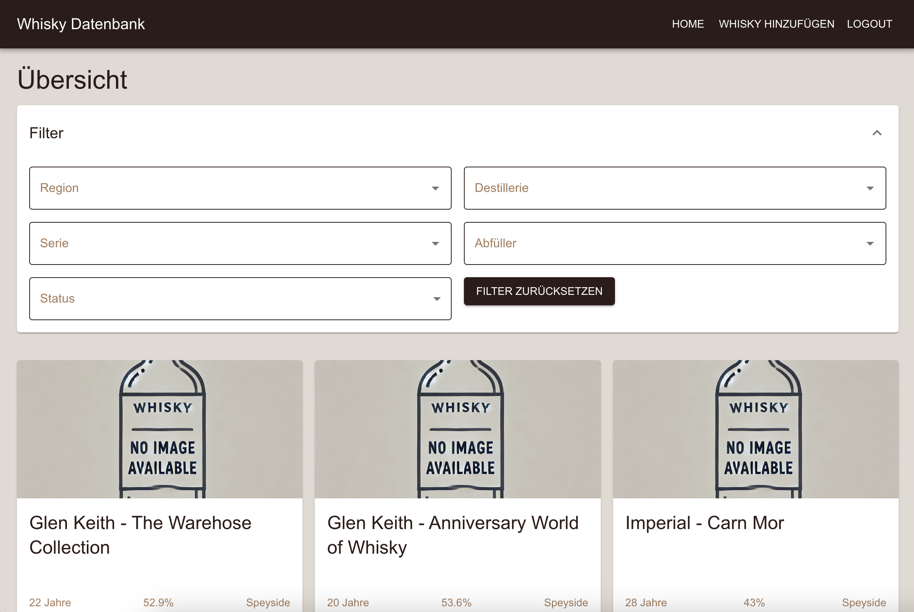

# Whisky Database
**IMPORTANT**: This project is currently in development and not yet ready for use. It is currently hacked together and by far not stable!

This is a fun "long weekend" project where I wanted to show my partner how I can transform his excel "database" easily in an application.

As he wanted to use the app on iOS, Android and desktop I decided to give react another try. I haven't touched it since 2019, and then I only did a nanodegree. The other option would've been Kotlin Multiplatform but it would've taken me more time to set it up and get it right.

Large Language Models (LLMs) were used to assist with the base structure and transforming data into the appropriate format for the backend.

## Features
- Whisky overview that shows all whiskies or those found that match a given filter
- Add new whiskies
- Edit existing whiskies
- German UI
- Design is somewhat fixed now.. it's the best I can come up on my own ;)

**Outlook:**
- Rate Whiskies
- Wishlist for whiskies that are not owned yet
- Maybe some fancy AI stuff with image recognition?

## Techstack
**React** in the frontend as it seemed easy enough to use as a noob and especially easy to host.  
**Appwrite** as my cloud backend service offering database, storage, and authentication capabilities with a free tier.

## Setup
1. Ensure you have Node.js and npm installed. You can download them from nodejs.org.
2. Create an Appwrite project at https://cloud.appwrite.io and set up the following:
- Create a new project
- Create a database with the following collections: `whiskies`, `distilleries`, `regions`, `series`, `bottlers`
- Create a storage bucket (e.g., named "whiskies")
- Enable Email/Password authentication

3. Add your development platform(s) in Appwrite Console → Settings → Platforms:
   - For localhost: `http://localhost:3000`
   - For mobile testing on local network: `http://[YOUR-LOCAL-IP]:3000` (e.g., `http://192.168.1.232:3000`)

4. Create a `.env.local` file with the following values (from your Appwrite project settings):
```
REACT_APP_APPWRITE_ENDPOINT="https://[LOCATION].cloud.appwrite.io/v1"
REACT_APP_APPWRITE_PROJECT_ID="[YOUR_PROJECT_ID]"
REACT_APP_APPWRITE_DATABASE_ID="[YOUR_DATABASE_ID]"
REACT_APP_APPWRITE_STORAGE_BUCKET_ID="[YOUR_BUCKET_ID]"
```

5. Install dependencies: `npm install`
6. Run the development server: `npm start`

## Licence
This project is licensed under the terms of the MIT license.
